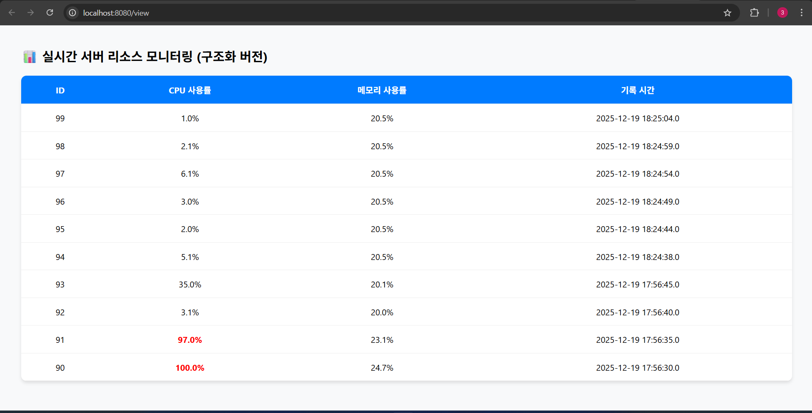

# server-monitoring-system
서버 자원 및 네트워크 상태를 실시간으로 모니터링하는 웹 기반 시스템

< 2025/12/16 시작 >

### 프로젝트 배경
~~서버와 네트워크를 운영하는 환경에서는 장애를 사전에 감지하고,
자원 사용 현황을 실시간으로 확인하는 것이 매우 중요.<br>
본 프로젝트는 서버 상태를 직관적으로 확인할 수 있는
모니터링 시스템을 구현하는 것을 목표.~~

### 프로젝트 목표
- ~~리눅스 서버의 자원 사용 현황을 실시간으로 수집한다~~
- ~~네트워크 상태를 시각적으로 확인할 수 있는 대시보드를 제공한다~~
- ~~서버 관리자의 운영 편의성을 높이는 웹 기반 환경을 구축한다~~

 ### 주요 기능
- ~~CPU, 메모리, 디스크 사용량 모니터링~~
- ~~서버 상태 실시간 조회~~
- ~~네트워크 트래픽 상태 확인~~
- ~~웹 대시보드를 통한 시각화~~


## 진행 기록
**2025/12/17**

- ~~가상 머신 기반 Fedora Linux 서버 환경에서 OpenJDK를 설치하여  
  Java 개발 환경을 구축하고, 서버 모니터링을 위한 Java 소스 코드를 작성하였다.~~

- ~~현재 단계에서는 기능 분리보다는 전체 동작 확인을 우선으로 하여,  
  Linux 서버 환경에서 CPU 점유율과 메모리 사용량을  웹 페이지를 통해 확인할 수 있도록 구현하였다.~~


## 구현 파일 설명

### SimpleMonitor.java
- ~~리눅스 서버의 CPU 사용률과 메모리 사용량을  **5초 주기**로 터미널에 출력하는 프로그램~~
- ~~시스템 자원 사용 현황을 실시간으로 확인하기 위한  기본 모니터링 기능을 담당~~


### SimpleHttpServer.java
- ~~리눅스 서버의 CPU 및 메모리 상태를  **HTTP 서버 형태로 외부에 제공**하는 프로그램~~
- ~~Java 내장 HTTP 서버를 사용하여  별도의 웹 서버 프레임워크 없이 구현~~

#### 사용 방법
1. ~~리눅스 서버 터미널에서 IP 주소 확인 후 컴파일 및 실행~~
   ```bash
   hostname -I
   javac -SimpleHttpServer.java
   java -SimpleHttpServer.java
2. ~~웹 브라우저(외부 PC)에서 아래 주소로 접속~~

   ~~http://[서버 IP 주소]:8080/status~~


## 실행 결과

### 웹 페이지에서 서버 상태 확인
~~~~

### 터미널에서 CPU 및 메모리 모니터링
~~~~


<br><br>

<span style="color:red; font-size:30px">위에 작업한 내용 삭제하고 다시 작업 </span>

**Python과 Java를 결합하여 작동하게 변경**


## Why..? 아래의 이유로 변경하였음.. ##


시스템 정보 수집에 최적화된 Python과 서버 인프라 관리에 강점이 있는 Java를 분리하여 설계 → 코드 가독성 향상의 이유로 변경.. +  코드 이해도가 너무 좋아짐
## 아키텍처 및 역할
- **Agent (Python)**  
  - 리눅스 서버의 자원 사용 정보를 수집하고 Java 서버로 전송 (**Push 방식**)
- **MonitoringServer (Java)**  
  - 데이터 수신 및 저장 (API/metrics)
  - 웹 기반 **대시보드(view) 페이지 운영**


#### 사용 방법 (Usage)

1. Java 서버 실행 (Windows)
   ```bash
   javac MonitoringServer.java
   java MonitoringServer
2. Python Agent 실행 및 웹 접속 (Linux)
     ```bash
     python3 agent.py
3.  웹 브라우저에서 http://[Windows_IP]:8080/view 접속


### 웹 페이지에서 서버 상태 확인


### 터미널에서 CPU 및 메모리 모니터링

<br>
<br>
<br>


**2025/12/19 진행기록** 
<br>
## 📂 파일별 역할 (File Responsibilities)

프로젝트의 각 구성 요소는 다음과 같은 명확한 역할을 수행합니다.

###  Python Agent
* **`agent.py`**: 
    - 리눅스 시스템의 `psutil` 라이브러리를 사용하여 자원 정보를 추출합니다.
    - 수집된 데이터를 자바 서버의 API 엔드포인트로 전송하는 송신자 역할을 합니다.

###  Java Server (Back-end)
* **`Metric.java`**: **DTO**
    - CPU 사용량, 메모리 사용량, 수집 시간 등 데이터를 규격화하여 담는 객체입니다.
* **`DatabaseRepository.java`**: **DAO**
    - 데이터베이스(MySQL)와 직접 연결됩니다.
    - 데이터를 테이블에 저장(`save`)하거나, 화면 출력을 위해 최신 데이터를 조회(`findAll`)합니다.
* **`MonitoringServer.java`**: **Controller/Server**
    - 파이썬 에이전트가 보낸 HTTP 요청을 수신합니다.
    - 수신된 데이터를 파싱하여 `DatabaseRepository`를 통해 DB에 기록합니다.
* **`MonitoringView.java`**: **View**
    - 저장된 데이터를 웹 브라우저에 HTML 표(Table) 형태로 출력합니다.
    - 사용자에게 시스템의 현재 상태를 시각적으로 보여줍니다.

---

## 🔄 데이터 흐름 (Data Flow)


1. **수집**: `agent.py`가 리눅스 자원 수집 후 서버로 전송
2. **수신/저장**: `MonitoringServer`가 수신 후 `DatabaseRepository`를 통해 DB 저장
3. **조회**: 사용자가 접속 시 `MonitoringView`가 DB 데이터를 꺼내 화면에 출력

---

## 추가 수정 ##
### 1. 데이터베이스 보안 강화 (Security)
* **설정 파일 분리**: DB 접속 정보를 `db.properties`로 외부화하여 소스 코드 노출을 방지했습니다.
* **Git ignore**: `.gitignore` 설정을 통해 민감한 보안 정보가 GitHub 저장소에 업로드되지 않도록 관리합니다.

### 2. 실시간 시각화 대시보드 (Visualization)
* **Chart.js 통합**: 최근 수집된 데이터를 바탕으로 실시간 추이를 확인할 수 있는 **꺾은선 그래프(Line Chart)**를 제공합니다.
* **상태 판별 로직**: 최근 10회 평균 CPU 사용량을 계산하여 서버 상태를 자동 판별합니다.
  - 🟢 **정상**: 40% 미만
  - 🟡 **주의**: 40% ~ 70%
  - 🔴 **위험**: 70% 이상

### 실행화면 


### 실행화면 

