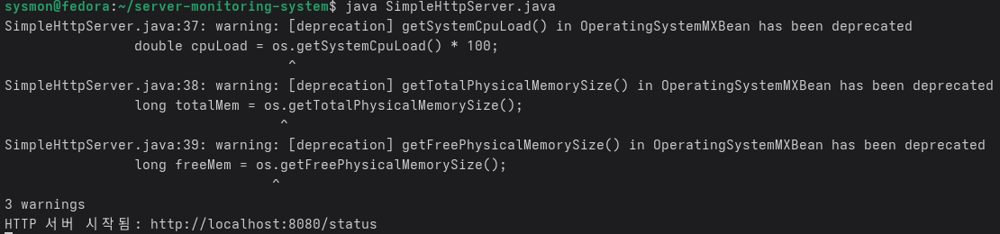
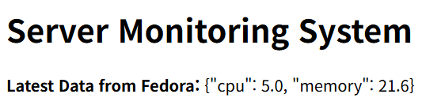
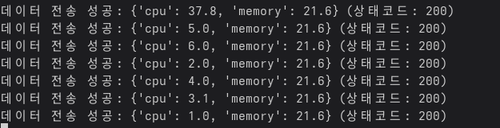
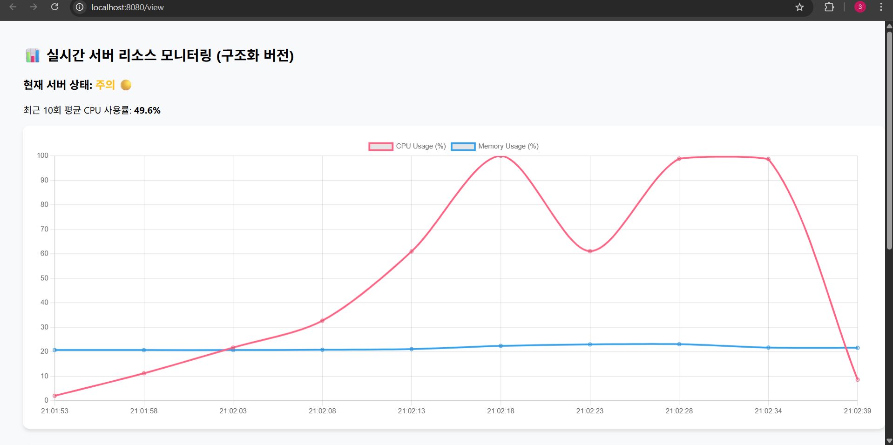
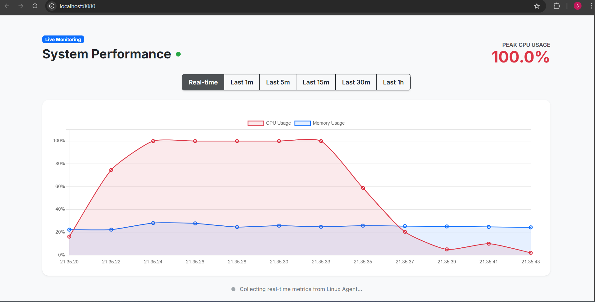

# server-monitoring-system
서버 자원 및 네트워크 상태를 실시간으로 모니터링하는 웹 기반 시스템

< 2025/12/16 시작 >

### 프로젝트 배경
~~서버와 네트워크를 운영하는 환경에서는 장애를 사전에 감지하고,
자원 사용 현황을 실시간으로 확인하는 것이 매우 중요.<br>
본 프로젝트는 서버 상태를 직관적으로 확인할 수 있는
모니터링 시스템을 구현하는 것을 목표.~~

### 프로젝트 목표
- ~~리눅스 서버의 자원 사용 현황을 실시간으로 수집한다~~
- ~~네트워크 상태를 시각적으로 확인할 수 있는 대시보드를 제공한다~~
- ~~서버 관리자의 운영 편의성을 높이는 웹 기반 환경을 구축한다~~

 ### 주요 기능
- ~~CPU, 메모리, 디스크 사용량 모니터링~~
- ~~서버 상태 실시간 조회~~
- ~~네트워크 트래픽 상태 확인~~
- ~~웹 대시보드를 통한 시각화~~


## 진행 기록
**2025/12/17**

- ~~가상 머신 기반 Fedora Linux 서버 환경에서 OpenJDK를 설치하여  
  Java 개발 환경을 구축하고, 서버 모니터링을 위한 Java 소스 코드를 작성하였다.~~

- ~~현재 단계에서는 기능 분리보다는 전체 동작 확인을 우선으로 하여,  
  Linux 서버 환경에서 CPU 점유율과 메모리 사용량을  웹 페이지를 통해 확인할 수 있도록 구현하였다.~~


## 구현 파일 설명

### SimpleMonitor.java
- ~~리눅스 서버의 CPU 사용률과 메모리 사용량을  **5초 주기**로 터미널에 출력하는 프로그램~~
- ~~시스템 자원 사용 현황을 실시간으로 확인하기 위한  기본 모니터링 기능을 담당~~


### SimpleHttpServer.java
- ~~리눅스 서버의 CPU 및 메모리 상태를  **HTTP 서버 형태로 외부에 제공**하는 프로그램~~
- ~~Java 내장 HTTP 서버를 사용하여  별도의 웹 서버 프레임워크 없이 구현~~

#### 사용 방법
1. ~~리눅스 서버 터미널에서 IP 주소 확인 후 컴파일 및 실행~~
   ```bash
   hostname -I
   javac -SimpleHttpServer.java
   java -SimpleHttpServer.java
2. ~~웹 브라우저(외부 PC)에서 아래 주소로 접속~~

   ~~http://[서버 IP 주소]:8080/status~~


## 실행 결과

### 웹 페이지에서 서버 상태 확인
~~~~

### 터미널에서 CPU 및 메모리 모니터링
~~~~


<br><br>

<span style="color:red; font-size:30px">위에 작업한 내용 삭제하고 다시 작업 </span>

**Python과 Java를 결합하여 작동하게 변경**


## Why..? 아래의 이유로 변경하였음.. ##


시스템 정보 수집에 최적화된 Python과 서버 인프라 관리에 강점이 있는 Java를 분리하여 설계 → 코드 가독성 향상의 이유로 변경.. +  코드 이해도가 너무 좋아짐
## 아키텍처 및 역할
- **Agent (Python)**  
  - 리눅스 서버의 자원 사용 정보를 수집하고 Java 서버로 전송 (**Push 방식**)
- **MonitoringServer (Java)**  
  - 데이터 수신 및 저장 (API/metrics)
  - 웹 기반 **대시보드(view) 페이지 운영**


#### 사용 방법 (Usage)

1. Java 서버 실행 (Windows)
   ```bash
   javac MonitoringServer.java
   java MonitoringServer
2. Python Agent 실행 및 웹 접속 (Linux)
     ```bash
     python3 agent.py
3.  웹 브라우저에서 http://[Windows_IP]:8080/view 접속


### 웹 페이지에서 서버 상태 확인


### 터미널에서 CPU 및 메모리 모니터링

<br>
<br>
<br>


# 📊 실시간 멀티 서버 리소스 모니터링 시스템
> **2025/12/19 진행 기록**

## 📂 파일별 역할 (File Responsibilities)

### 🐍 Python Agent
* **`agent.py`**: 
    - 리눅스 시스템의 `psutil` 라이브러리를 사용하여 자원 정보를 추출합니다.
    - **에이전트 식별자(`agent_name`)**를 포함한 데이터를 JSON 형식으로 전송합니다.

### ☕ Java Server (Back-end)
* **`Metric.java` (DTO)**: 
    - 데이터를 규격화하여 담는 객체로, 어떤 서버에서 온 데이터인지 구분하기 위한 `agentName` 필드를 포함합니다.
* **`DatabaseRepository.java` (DAO)**: 
    - JDBC를 통해 MySQL과 연결되며, 서버별 식별자를 포함하여 데이터를 저장(`save`)하고 조회(`findAll`)합니다.
* **`MonitoringServer.java` (Controller)**: 
    - 외부 라이브러리(`org.json`)를 사용하여 수신된 JSON 데이터를 파싱하고 로직을 제어합니다.
* **`MonitoringView.java` (View)**: 
    - 저장된 데이터를 웹 브라우저에 출력하며, Chart.js를 통해 실시간 그래프를 렌더링합니다.

---

## 🔄 데이터 흐름 (Data Flow)


1. **수집**: `agent.py`가 리눅스 자원 수집 및 JSON 패키징 후 서버로 전송
2. **수신/저장**: `MonitoringServer`가 JSON 파싱 후 `DatabaseRepository`를 통해 DB 저장
3. **조회**: 사용자가 접속 시 `MonitoringView`가 DB 데이터를 꺼내 서버별로 화면에 출력

---

## ✨ 주요 업데이트 및 개선 사항

### 1. 멀티 에이전트 식별 및 확장성 (Scalability)
* **에이전트 고유 식별**: 각 에이전트마다 `agent_name`을 부여하여, 하나의 중앙 서버에서 다수의 서버(예: Fedora, Windows, Seoul-01 등)를 통합 관리할 수 있습니다.
* **유연한 확장**: 서버 코드 수정 없이 새로운 에이전트를 실행하는 것만으로 모니터링 대상을 즉시 추가할 수 있습니다.

### 2. JSON 기반 데이터 표준화 (Standardization)
* **표준 프로토콜**: 단순 문자열 파싱(`split`)에서 벗어나 표준 데이터 포맷인 **JSON**을 채택하여 통신 안정성을 높였습니다.
* **라이브러리 통합**: `json-20231013.jar`를 사용하여 복잡한 데이터 구조도 명확하게 처리합니다.

### 3. 실시간 시각화 및 보안 (Visualization & Security)
* **Chart.js 대시보드**: 꺾은선 그래프를 통해 CPU/Memory 변화 추이를 시각화합니다.
* **보안 강화**: `db.properties`를 통한 설정 분리 및 `.gitignore`를 활용한 민감 정보 노출 방지.
* **상태 판별**: 최근 10회 평균 CPU 사용량을 기준으로 **정상(🟢), 주의(🟡), 위험(🔴)** 상태를 자동 표시합니다.

---

## 📊 데이터 통신 규격 (JSON Example)
에이전트는 서버로 다음과 같은 표준 규격의 데이터를 전송합니다.
```json
{
  "agent_name": "Fedora-Server-01",
  "cpu": 24.5,
  "memory": 58.2
}
```

### 실행화면 



# 🔔 실시간 알림 시스템 및 프론트엔드 아키텍처 고도화
> **2025/12/20 진행 기록**

## 📂 파일 구조 혁신 및 역할 분담 (Architecture Refactoring)
기존의 Java 코드 내에서 HTML을 생성하던 방식(`MonitoringView.java`)을 폐기하고, **프론트엔드와 백엔드를 완전히 분리**하여 유지보수성을 극대화했습니다.

### ☕ Java Server (Back-end)
* **`MonitoringServer.java` (API Only)**: 
    - 더 이상 직접 HTML 코드를 작성하지 않습니다. 
    - `/api/metrics` (데이터 수신), `/api/history` (데이터 제공) 등 **순수 API 서버**의 역할에 집중합니다.
* **`TelegramService.java` (Notification)**: 
    - 텔레그램 봇 API를 활용하여 관리자에게 실시간 메시지를 전송합니다.
    - 서버 성능 저하를 방지하기 위해 **비동기(Thread) 방식**으로 알림을 처리합니다.

### 🌐 Web Dashboard (Front-end / 리소스 분리)
* **`monitoring.html` (Structure)**: 대시보드의 전체 구조와 레이아웃을 담당합니다.
* **`style.css` (Presentation)**: 차트 크기, 상태 표시등(Status Dot) 등 UI 디자인을 전담합니다.
* **`script.js` (Interaction & logic)**: 
    - API를 통해 데이터를 Fetch하고 Chart.js를 컨트롤하는 핵심 비즈니스 로직을 담당합니다.

---

## ✨ 주요 업데이트 및 개선 사항

### 1. 프론트엔드/백엔드 분리 (Decoupling)
* **`MonitoringView.java` 삭제**: Java 코드와 HTML이 뒤섞여 있던 기존 코드를 과감히 삭제하여 결합도를 낮췄습니다.
* **정적 리소스 서빙**: Java 서버가 `resources` 폴더 내의 HTML, CSS, JS 파일을 독립적으로 클라이언트에 전송하도록 개선하여 협업 및 유지보수가 용이해졌습니다.

### 2. 텔레그램 기반 지능형 알림 (Smart Notification)
* **임계치 기반 경고**: CPU 사용량이 설정값(예: 80%)을 초과할 경우 즉각적인 메시지를 발송합니다.
* **에이전트 연결 상태 감시(Heartbeat)**: 
    - 서버 메인 로직과 별개로 작동하는 감시 스레드를 생성하여 에이전트의 생존 여부를 주기적으로 체크합니다.
    - **연결됨 / 연결 끊김** 상태 변화 시에만 알림을 발송하여 중복 알림을 방지했습니다.

### 3. 대시보드 시각화 디테일 최적화 (UI/UX)
* **상단 짤림 현상(Clipping) 해결**: 
    - 데이터가 100%일 때 포인트가 잘리는 문제를 방지하기 위해 Y축 최댓값을 `110%`로 상향하고 내부 여백을 추가했습니다.
    - Y축 숫자는 `callback` 함수를 통해 `100%`까지만 표시되도록 커스텀했습니다.
* **차트 안정성 및 가독성**: 
    - 애니메이션 최적화를 통해 실시간 업데이트 시 그래프 흔들림을 제거했습니다.
    - 마우스 호버 시 포인트 강조 및 툴팁 활성화를 통해 상세 수치 확인 기능을 강화했습니다.

---

## 🛠️ 알림 시나리오 (Notification Scenarios)
1. **연결 성공**: `✅ [알림] 에이전트가 서버에 연결되었습니다.`
2. **연결 유실**: `🚨 [경고] 에이전트 연결이 끊어졌습니다! (데이터 수집 중단)`
3. **과부하 발생**: `⚠️ [과부하] CPU 사용량 급증! (CPU: 85.4%, MEM: 60.2%)`

### 실행화면 (UI 및 아키텍처 개선 결과)


<p align="center">
  
</p>


